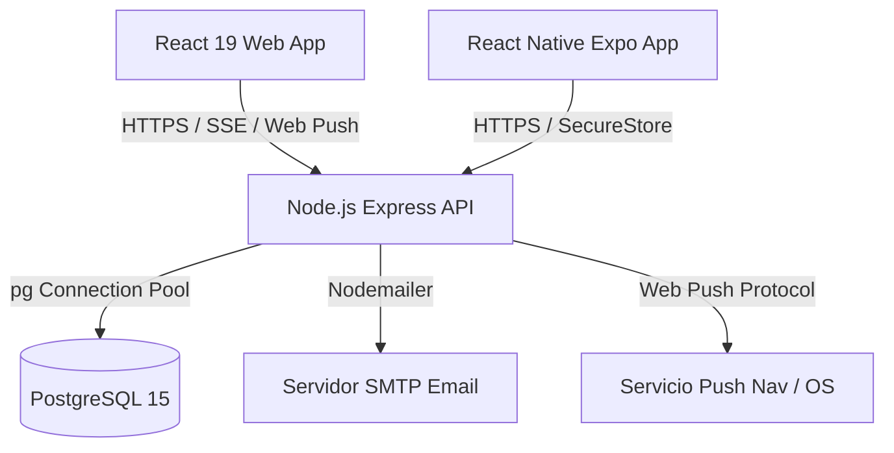

# TunguMarket 🛒

[](https://www.docker.com/)
[](https://react.dev/)
[](https://reactnative.dev/)
[](https://nodejs.org/)
[](https://www.postgresql.org/)
[](https://vite.dev/)
[](https://expo.dev/)

TunguMarket es una plataforma unificada y multiplataforma de comercio electrónico y marketplace local diseñada específicamente para dinamizar la economía e impulsar el crecimiento de los pequeños y medianos emprendimientos (PyMEs) en la provincia de **Tungurahua, Ecuador**. 

---

## 📝 Descripción

En la región de Tungurahua, muchos productores artesanales, agricultores y fabricantes de calzado y textiles carecen de canales digitales optimizados para comercializar sus productos. **TunguMarket** resuelve esta brecha ofreciendo un espacio seguro que conecta de forma directa a compradores y vendedores de la comunidad. 

El sistema implementa flujos transaccionales completos, incluyendo carritos multi-vendedor, control de inventario en tiempo real, validación automatizada de pagos mediante depósitos o transferencias bancarias, y un sistema financiero de billetera virtual interna para agilizar la dispersión y retiro de fondos hacia cuentas bancarias ecuatorianas.

---

## ✨ Características Principales

*   **Experiencia Multiplataforma:** Aplicación web responsiva (React + Vite) y aplicación móvil nativa híbrida para iOS y Android (Expo + React Native) que comparten las mismas reglas de negocio del backend.
*   **Gestión Segura de Autenticación:** Registro de usuarios mayores de 18 años, validación obligatoria de cuentas por código PIN de 6 dígitos enviado por correo electrónico y recuperación segura de contraseñas.
*   **Billetera Virtual (Wallet):** Registro granular de transacciones internas (`earning`, `withdrawal`, `refund`, `debt_commission`, `debt_payment`). Permite a los vendedores acumular sus ganancias y gestionar solicitudes de retiro.
*   **Flujo de Checkout y Pagos:** Procesamiento de compras a través de pagos simulados con tarjeta, efectivo o transferencias/depósitos bancarios mediante la carga de comprobantes, los cuales cuentan con protección anti-fraude que detecta duplicados mediante hashes criptográficos.
*   **Gestión de Catálogo y Moderación:** Carga y actualización de productos con fotos de galería. El sistema cuenta con filtros automáticos de palabras clave prohibidas (armas, sustancias controladas, copias ilegales) y soporte para borrado lógico (*soft delete*) para proteger el historial de compras.
*   **Notificaciones en Tiempo Real:** Alertas instantáneas empujadas a través de Server-Sent Events (SSE) con soporte keep-alive (heartbeats) y notificaciones de respaldo Web Push (protocolo VAPID).
*   **Automatización de Deudas (CRON):** Tarea programada en segundo plano que bloquea perfiles de vendedores deudores que poseen balances negativos de comisiones el primer día de cada mes.
*   **Accesibilidad Visual Avanzada (Web):** Widget flotante con opciones para cambiar dinámicamente a Modo Oscuro, Alto Contraste (para baja visión) y Texto en Negritas con persistencia local.

---

## 🛠️ Tecnologías Utilizadas

### Backend
*   **Node.js** con **Express.js** (Arquitectura RESTful con ES Modules)
*   **PostgreSQL 15** (Motor relacional) con pools de conexiones nativos (`pg`)
*   **Autenticación:** JSON Web Tokens (JWT) y hashing con `bcryptjs`
*   **Notificaciones:** `web-push` (VAPID) y Server-Sent Events (SSE)
*   **Automatización:** `node-cron`
*   **Manejo de archivos:** `multer` (almacenamiento local de imágenes)
*   **Correo Electrónico:** `nodemailer`

### Frontend Web
*   **React 19** & **Vite** (Compilación ultrarrápida)
*   **Tailwind CSS** & **Framer Motion** (Estilos adaptables y micro-animaciones fluidas)
*   **React Router v7** (Enrutamiento del lado del cliente con guards de seguridad)

### Aplicación Móvil
*   **React Native** & **Expo 54**
*   **Expo Router** (Navegación basada en archivos de sistema)
*   **NativeWind** (Utilidades de Tailwind CSS aplicadas a componentes nativos móviles)
*   **Expo SecureStore** (Guardado seguro y cifrado de tokens JWT de sesión)

---

## 🏗️ Arquitectura del Sistema

El ecosistema está construido bajo un enfoque cliente-servidor desacoplado, comunicándose mediante peticiones seguras HTTPS y una transmisión continua de eventos SSE en tiempo real:



---

## 📂 Estructura del Proyecto

```text
TunguMarket/
├── backend/                   # Código del servidor (API REST)
│   ├── src/
│   │   ├── config/            # Pool de conexiones a base de datos
│   │   ├── controllers/       # Controladores de lógica de endpoints
│   │   ├── middlewares/       # Filtros de roles, autenticación JWT y subidas
│   │   ├── models/            # Consultas e interacción directa con PostgreSQL
│   │   ├── routes/            # Mapeo de rutas HTTP Express
│   │   ├── services/          # Procesamiento de pagos, Web Push, SSE y moderación
│   │   └── utils/             # Tareas programadas (cron) e inicializador de tablas
│   └── server.js              # Punto de entrada de la API backend
├── frontend/                  # SPA Web del Cliente y Administrador
│   ├── src/
│   │   ├── api/               # Peticiones Fetch centralizadas
│   │   ├── components/        # Componentes comunes (modales, cards, route guards)
│   │   ├── context/           # Estados globales (Auth, Cart, Theme)
│   │   └── pages/             # Vistas de catálogo, perfil, compras y administración
│   └── vite.config.js         # Configuración de compilación de Vite
├── mobile/                    # Aplicación Móvil Expo
│   ├── app/                   # Sistema de pantallas de Expo Router (tabs, auth)
│   ├── src/
│   │   ├── api/               # Cliente HTTP e interpolación dinámica de IPs locales
│   │   ├── components/        # Elementos nativos de interfaz de usuario
│   │   └── constants/         # Tema de diseño, colores y tipografía
│   └── tailwind.config.js     # Configuración de TailwindCSS para NativeWind
└── Utils/                     # Herramientas de orquestación de desarrollo local
    └── Iniciar dockers.js     # Gestor CLI para desarrollo en Windows
```

---

## ⚙️ Requisitos Previos

Antes de levantar el entorno local, asegúrate de tener instalado en tu máquina:
*   [Node.js](https://nodejs.org/) (Versión v18.0.0 o superior)
*   [Docker](https://www.docker.com/) & Docker Compose
*   [Git](https://git-scm.com/)

---

## 🚀 Instalación y Despliegue Local

Sigue estos pasos para clonar y ejecutar TunguMarket localmente utilizando las herramientas provistas:

### 1. Clonar el Repositorio
```bash
git clone https://github.com/JohanRod/TunguMarket.git
cd TunguMarket
```

### 2. Configurar Variables de Entorno
Crea un archivo `.env` en la raíz del directorio `backend/` basado en la sección de variables de entorno de este documento.

### 3. Ejecutar mediante el Gestor de Orquestación (Recomendado en Windows)
TunguMarket cuenta con un script CLI interactivo en Node.js que simplifica el desarrollo local levantando la BD de PostgreSQL en Docker, inicializando las tablas relacionales con sus triggers SQL y lanzando terminales con logs independientes de cada servicio.

Ejecútalo desde la raíz del proyecto con:
```bash
node Utils/"Iniciar dockers.js"
```
Selecciona la opción deseada en el panel interactivo:
*   **Opción 1:** Limpieza de volúmenes, reconstrucción de imágenes e inicialización completa del esquema de base de datos.
*   **Opción 2:** Inicio rápido sin alterar los datos persistidos en PostgreSQL.

> [!NOTE]
> El orquestador CLI detecta automáticamente tu dirección IP local física y configura `REACT_NATIVE_PACKAGER_HOSTNAME` para que la app de Expo en tu dispositivo móvil pueda conectarse al servidor backend local.

---

## 🔒 Variables de Entorno

El backend requiere configurar las siguientes variables de entorno para su correcto funcionamiento:

| Variable | Descripción | Valor por Defecto |
|---|---|---|
| `PORT` | Puerto en el que escucha la API Express | `5000` |
| `POSTGRES_USER` | Usuario administrador de PostgreSQL | `postgres` |
| `POSTGRES_PASSWORD` | Contraseña del usuario de base de datos | `postgres` |
| `POSTGRES_DB` | Nombre de la base de datos | `tungumarket` |
| `POSTGRES_HOST` | Dirección del host de base de datos | `db` (en docker) o `localhost` |
| `POSTGRES_PORT` | Puerto de conexión de base de datos | `5432` |
| `JWT_SECRET` | Llave secreta para firmar y validar tokens JWT | `super_secret_jwt_key_here` |
| `EMAIL_USER` | Dirección de correo de salida para Nodemailer | *(Requerido para correos)* |
| `EMAIL_PASS` | Contraseña de aplicación del correo de salida | *(Requerido para correos)* |
| `EMAIL_HOST` | Host SMTP para envío de correos | `smtp.gmail.com` |
| `EMAIL_PORT` | Puerto de conexión SMTP | `587` |
| `EMAIL_FROM` | Remitente visible en los correos salientes | `TunguMarket <noreply@tungumarket.com>` |
| `VAPID_PUBLIC_KEY` | Clave pública VAPID para notificaciones Web Push | *(Opcional)* |
| `VAPID_PRIVATE_KEY` | Clave privada VAPID para notificaciones Web Push | *(Opcional)* |
| `VAPID_EMAIL` | Correo mailto para configuración VAPID | `mailto:admin@tungumarket.com` |

---

## 💻 Uso y Scripts Disponibles

### Módulo Backend (`/backend`)
*   `npm run dev`: Ejecuta la API con recarga automática usando `nodemon`.
*   `npm start`: Inicia el servidor de producción.

### Módulo Frontend Web (`/frontend`)
*   `npm run dev`: Inicia el servidor de desarrollo local de Vite en `http://localhost:5173`.
*   `npm run build`: Genera el empaquetado de producción optimizado en la carpeta `/dist`.
*   `npm run lint`: Ejecuta auditoría estática del código con ESLint.
*   `npm run preview`: Previsualiza el build de producción localmente.

### Módulo Móvil (`/mobile`)
*   `npm start`: Inicia el servidor de desarrollo de Expo Metro.
*   `npm run android`: Arranca el emulador de Android o compila para un dispositivo Android conectado.
*   `npm run ios`: Arranca el emulador de iOS.
*   `npm run web`: Arranca el cliente de Expo en navegador.

---

## 🗺️ Roadmap de Desarrollo

### Funcionalidades Completadas ✅
*   [x] Estructura multiplataforma funcional (Web y Móvil).
*   [x] Autenticación JWT y validación obligatoria de correo con PIN de 6 dígitos criptográfico.
*   [x] Billetera virtual integrada con flujos de cobros de comisiones y reembolsos automáticos.
*   [x] Algoritmo de borrado lógico (*soft delete*) de productos para no romper el historial de compras.
*   [x] Detección de duplicación de comprobantes de pago por hashing de metadatos.
*   [x] Panel de moderación de contenido inapropiado automatizado.
*   [x] Widget visual de accesibilidad para personas con dificultades visuales.
*   [x] Notificaciones instantáneas (SSE con heartbeats y Web Push).
*   [x] Paginación dinámica y scroll infinito en catálogo móvil.
*   [x] Orquestación de desarrollo local y healthchecks de arranque seguro de Docker.

### Mejoras Futuras 🚀
*   [ ] Integración real con pasarelas de pago de Ecuador (Payphone, Kushki).
*   [ ] Sistema de geolocalización y cálculo de costos de envío automatizados basados en coordenadas cantonales de Tungurahua.
*   [ ] Sistema de chat interno integrado en tiempo real (vía WebSockets) entre comprador y vendedor.
*   [ ] Reportes financieros avanzados descargables en PDF y Excel para vendedores.

---

## 👥 Contribuidores

| Nombre | Commits |
|---|---|
| Johan Rodríguez | 66 |
| MarlonKuna26 | 13 |
| Alan Cuenca | 2 |

---

## 📄 Licencia

El proyecto no posee una licencia definida actualmente (Todos los derechos reservados).

---

## 👤 Autores

*   **Johan Rodríguez**
*   **MarlonKuna26**
*   **Alan Cuenca**
